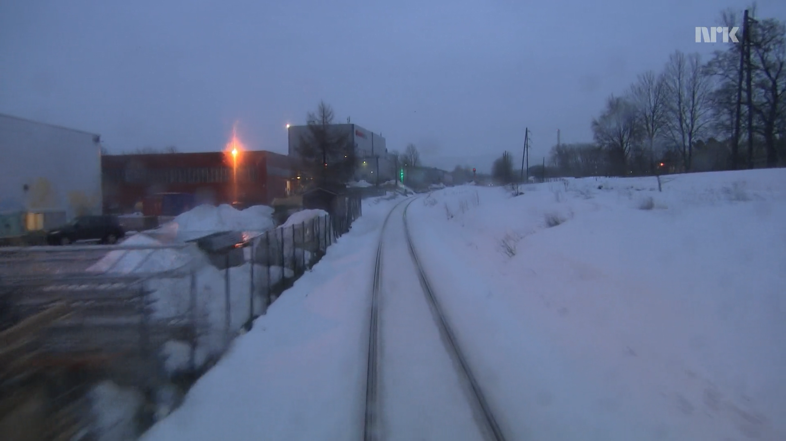
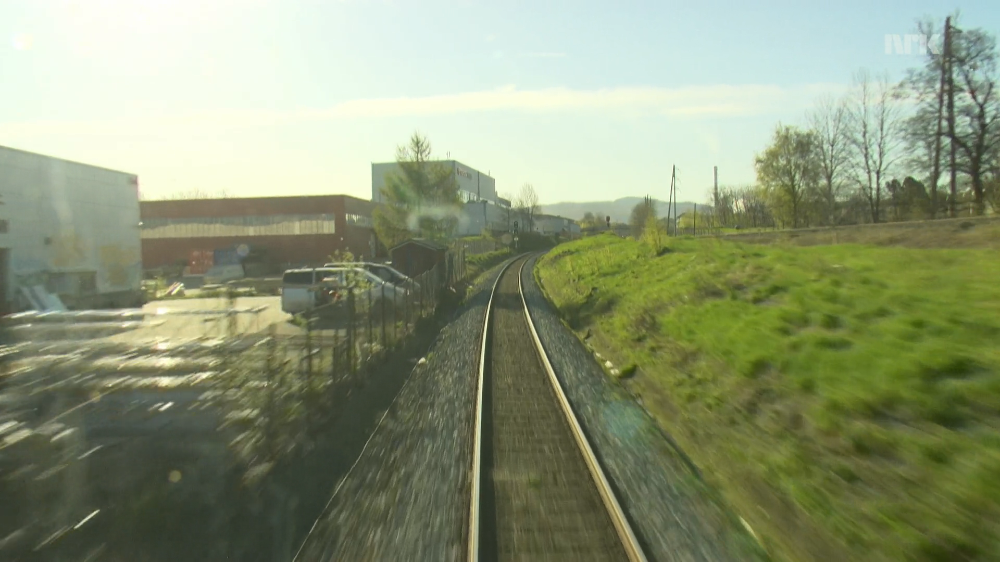
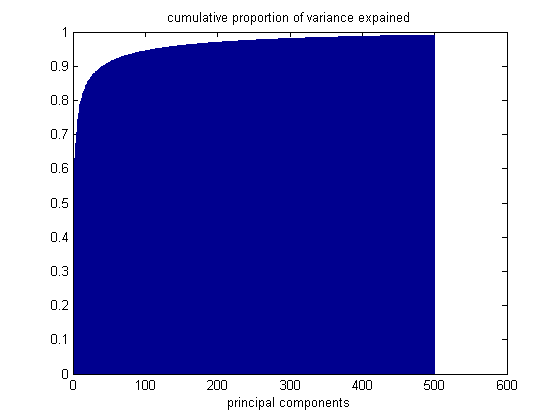
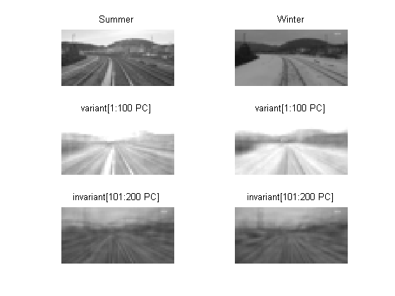

# Unsupervised-learning-of-condition-invariant-image representaion using Principal Component Analysis

---

**Motivation::**
Identifying the place in different seasons is a challenging task for a machine.

 

Since the top principal components will cotain the most information of the image, we discarded top Principal components and took less important principal components. Details are described in this paper named "Unsupervised Online Learning of Condition-Invariant Images for Place
Recognition"

# Number of principal Components;
are chosen by looking at the percentage of variance is explained by the PC's

This figure (below) shows that it is possible to make condition invariant features after projecting on PC's.

#Distance matrix::

